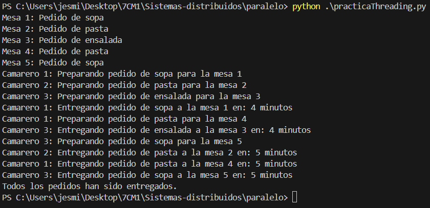

Este programa simula un restaurante con mesas que hacen pedidos y camareros que preparan y entregan esos pedidos. Utiliza hilos (`threads`) para simular la concurrencia entre las mesas y los camareros. A continuación, se explica el funcionamiento del programa paso a paso:

1. **Importaciones y Constantes**:
   
   - Se importan las bibliotecas `threading`, `time` y `random`.
   - Se definen varias constantes:
     - `NUM_MESAS`: Número de mesas en el restaurante.
     - `NUM_CAMAREROS`: Número de camareros disponibles.
     - `TIEMPO_PREPARACION_MIN`: Tiempo mínimo de preparación de un pedido.
     - `TIEMPO_PREPARACION_MAX`: Tiempo máximo de preparación de un pedido.
     - `PLATOS`: Lista de platos disponibles para pedir.

2. **Colas de pedidos**:
   
   - `pedidos`: Lista que actúa como una cola para almacenar los pedidos de las mesas.
   - `lock_pedidos`: Un `Lock` para asegurar que el acceso a la lista de pedidos sea seguro en un entorno de múltiples hilos.

3. **Función `mesa`**:
   
   - Simula una mesa que hace un pedido.
   - Selecciona un plato aleatorio de la lista PLATOS.
   - Usa un `Lock` para asegurar que el acceso a la lista de pedidos sea seguro y añade el pedido a la lista.
   - Imprime un mensaje indicando el pedido realizado.

4. **Función `camarero`**:
   
   - Simula un camarero que prepara y entrega pedidos.
   - En un bucle infinito, intenta obtener un pedido de la lista de pedidos.
   - Si no hay pedidos, el bucle se rompe y el hilo termina.
   - Si hay un pedido, lo saca de la lista y simula el tiempo de preparación usando `time.sleep`.
   - Imprime mensajes indicando que está preparando y entregando el pedido.

5. **Creación de hilos para mesas**:
   
   - Se crean hilos para cada mesa usando `threading.Thread`, asignando la función `mesa` como objetivo y pasando el número de mesa como argumento.

6. **Creación de hilos para camareros**:
   
   - Se crean hilos para cada camarero de manera similar, asignando la función `camarero` como objetivo y pasando el número de camarero como argumento.

7. **Inicio de hilos de mesas**:
   
   - Se inician todos los hilos de las mesas, lo que hace que cada mesa haga su pedido.

8. **Esperar a que todas las mesas terminen**:
   
   - Se usa `join` en cada hilo de mesa para asegurarse de que todos los pedidos se hayan hecho antes de que los camareros empiecen a trabajar.

9. **Inicio de hilos de camareros**:
   
   - Se inician todos los hilos de los camareros, lo que hace que empiecen a preparar y entregar los pedidos.

10. **Esperar a que todos los camareros terminen**:
    
    - Se usa` join` en cada hilo de camarero para asegurarse de que todos los pedidos hayan sido entregados antes de terminar el programa.

11. **Mensaje final**:
    
    - Se imprime un mensaje indicando que todos los pedidos han sido entregados.

Ejemplo de ejecucion: 

  
